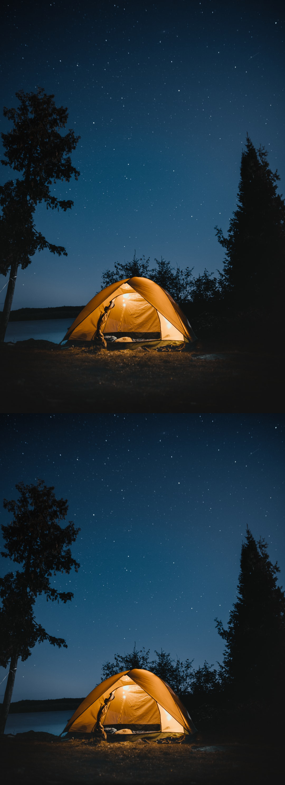

# Sujet choisi

J'ai choisi le sujet 2 : redimensionnement liquide
 
 # Fonction energy

La fonction *energy* est la fonction qui permet de calculer l'energie de chaque pixel afin de pouvoir déterminer quels pixels suivrent pour trouver le chemin à éliminer.
Pour déterminer l'énergie d'un pixel, on se sert de la convolution appliqué sur l'image grâce au noyau que nous avons choisi (ici le même que pour Sobel dans les TP précédent).
Enfin, nous sommons toutes les valeur de l'axe z afin d'obtenir la valeur de l'energie d'un pixel.

# Fonction minimum_energy

La fonction *minimum_energy* est la fonction qui vérifie quels pixels proches ont la plus faible énergie.
Cette fonction stock également les indice des point supprimé afin de pouvoir retrouver le point précédent à supprimer par la suite.
Pour déterminer le chemin de pixel le plus faible en énergie, on parcours toute l'image en partant de la deuxième ligne (car la première n'a pas de valeur parent) et, pour chaque pixel, on lui ajout la valeur d'un des trois pixel au-dessus de lui, en fonction de celui qui a la plus faible valeur.

# Fonction remove_min_track

La fonction *remove_min_track* est la fonction qui supprime le chemin de plus faible énergie.
Pour ce faire, on créé un mask qui permettera de sauvgarder tous les indice de pixel à supprimer et on vérifie pour chaque ligne, en partant du bas, quel colonne a la plus faible énergie. Ensuite, on met le bit du mask correspondant à ces coordonnées à faux.
Pour finir, on redimensionne l'image en fonction des des bits mit à faux dans le mask.

# Remove

La fonction *remove* est la fonction qui, tant que la nouvelle taille de l'image n'a pas été atteinte, supprime la ligne de plus faible énergie.

# Autre foncitonnalités

Selon si l'on appel la fonction avec comme troisième argument 'h' ou 'v', l'image sera rotatée de 90° afin de supprimer les ligne et non les colonne. Elle sera par la suite rotatée de -90° afin d'être remise dans le bon sens.

La trackbar permet de redéfinir la valeur de **scale**, qui permet de déterminer la nouvelle taille de l'image. Cependant, le calcul est très long et l'affichage ne foncitonne pas.

La librairie scikit-image n'est probablement plus compatible avec la version d'opencv que j'ai sur mon pc (idem pour les pc de la salle J2), car il est impossible d'utiliser la méthode seam_carving comme indique dans la documentation.

# Exemple

Le chateau de la page wikipédia à 0.5 fois sa taille en mode vertical (suppression des colonnes)

Commande : *python3 seam_carving.py chateau.png 0.5 v*

Un visage à 0.8 fois sa taille en mode horizontal (suppression des lignes)

Commande : *python3 seam_carving.py visage.png 0.8 h*

Un paysage de camping à 0.9 fois sa taille en mode horizontal

Commande : *python3 seam_carving.py camping.png 0.9 h*

